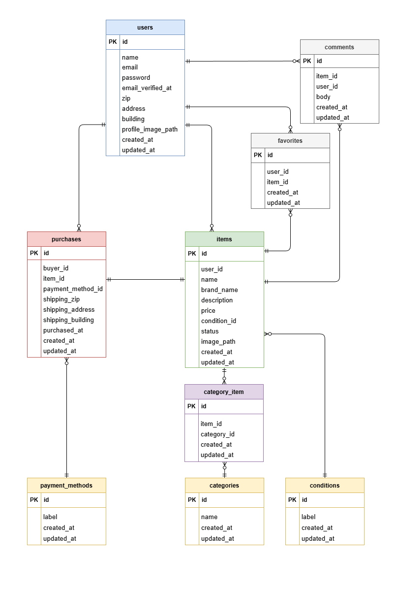

# フリマアプリ

## 環境構築
#### 1. リポジトリをクローン
```bash
git clone git@github.com:ando1221/flea-market.git
cd flea-market
```
#### 2. Dockerコンテナをビルド・起動
```bash
docker compose up -d --build
```
#### 3. PHPコンテナに入る
```bash
docker compose exec php bash
```
#### 4. Laravelをインストール
```bash
composer install
```
#### 5. .env を作成して環境変数を設定
```bash
cp .env.example .env
```
```env
DB_CONNECTION=mysql
DB_HOST=mysql
DB_PORT=3306
DB_DATABASE=laravel_db
DB_USERNAME=laravel_user
DB_PASSWORD=laravel_pass

MAIL_MAILER=smtp
MAIL_HOST=mailhog
MAIL_PORT=1025
MAIL_USERNAME=null
MAIL_PASSWORD=null
MAIL_ENCRYPTION=null
MAIL_FROM_ADDRESS=test@example.com

MAIL_FROM_NAME="${APP_NAME}"
```
#### 6. Stripe ダッシュボードで API キーを取得する
```env
STRIPE_KEY=pk_test_xxxxxxxxxxxxxxxxxxxxx
STRIPE_SECRET=sk_test_xxxxxxxxxxxxxxxxxxxxx
```
<br>

> ローカル環境では Stripe から localhost に直接 Webhook を送れないため、Stripe CLI を使用します
#### 7. Stripe CLI にログインする
```bash
stripe login
```
#### 8. Webhook を Laravel に転送する
```bash
stripe listen --events checkout.session.completed --forward-to http://localhost/stripe/webhook
```
#### 9. 表示された Webhook secret を .env に設定する
```env
STRIPE_WEBHOOK_SECRET=whsec_xxxxxxxxxxxxxxxxxxxxx
```
#### 10. アプリケーションキーを生成
```bash
php artisan key:generate
```
#### 11. 画像表示用のシンボリックリンクを作成
```bash
php artisan storage:link
```
#### 12. マイグレーション & シーディング
```bash
php artisan migrate:fresh --seed
```

> 権限設定について（初回のみ）

Docker 環境で Laravel を起動する際、<br>
storage および bootstrap/cache ディレクトリに書き込み権限が無く<br>
エラーが発生する場合があります。<br>
<br>
その場合は、php コンテナ内で storage と bootstrap/cache に<br>
書き込み権限を付与することでアプリケーションが正常に動作します。<br>

※ 本設定はローカル開発環境向けです。<br>


## 使用技術(実行環境)
- PHP 8.x
- Laravel 8.x
- MySQL 8.0
- Nginx 1.21
- MailHog
- Docker / Docker Compose
## URL
- 商品一覧（トップ画面）：http://localhost<br>
- 会員登録画面：http://localhost/register<br>

- MailHog：http://localhost:8025<br>

- phpMyAdmin：http://localhost:8080/<br>

## シーディング内容

初期設定データとして categories、conditions、payment_methods を登録し、
デモデータとしてユーザー、商品、コメント、お気に入り、購入データを登録しています。

#### テスト用アカウント
**出品ユーザー**<br>
email: seller@example.com<br>
password: password123<br>

**出品ユーザー**<br>
email: buyer@example.com<br>
password: password123<br>

**出品ユーザー**<br>
email: viewer@example.com<br>
password: password123<br>

## 画像アップロードについて
アップロード時にローカル環境から選択してアップロードすることができます。
アップロードされた画像は以下のディレクトリに保存されます。

- 商品画像：storage/app/public/products<br>
- プロフィール画像：storage/app/public/profiles

## ER図
<details>
<summary>ER図を表示する</summary>



</details>

## テスト手順
#### 1. テスト用 .env を作成して環境変数を設定
```bash
cp .env .env.testing
```
```env
APP_ENV=testing
APP_KEY=
APP_DEBUG=true
APP_URL=http://localhost

DB_CONNECTION=mysql
DB_HOST=mysql
DB_PORT=3306
DB_DATABASE=laravel_test_db
DB_USERNAME=laravel_user
DB_PASSWORD=laravel_pass

CACHE_DRIVER=array
QUEUE_CONNECTION=sync
SESSION_DRIVER=array
MAIL_MAILER=array
```
#### 2. テスト用データベースを作成する
```bash
docker compose exec mysql bash
mysql -u root -p
```
```sql
CREATE DATABASE laravel_test_db;
```
#### 3. アプリケーションキーを生成する
```bash
docker compose exec php php artisan key:generate --env=testing
```
#### 4. テストを実行する
> すべて実行する場合
```bash
docker compose exec php php artisan test
```
> 特定ファイルのみ実行する場合
```bash
docker compose exec php php artisan test tests/Feature/ディレクトリ名/ファイル名
```
> 特定テストのみ実行する場合
```bash
docker compose exec php php artisan test --filter=テスト名
```